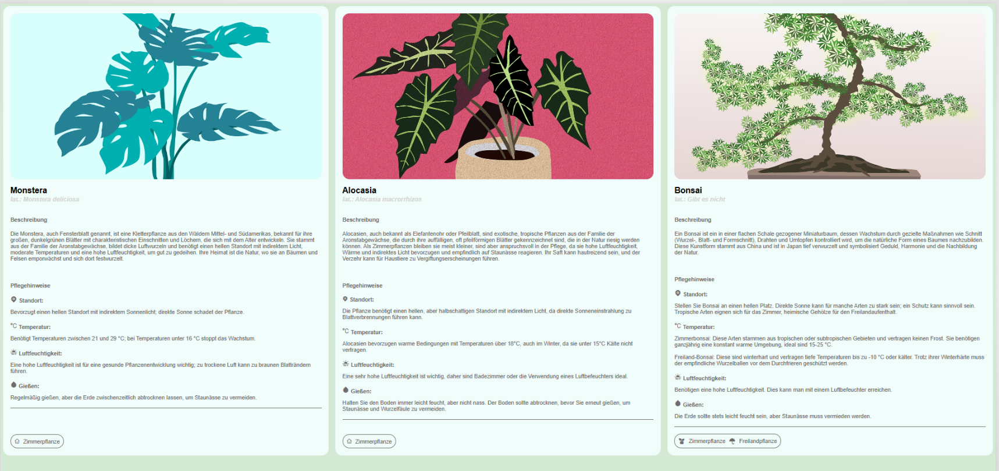

# Component Card

Eine kleine UI-Komponente für eine Pflanzenkarte im Vanilla HTML/CSS-Stack mit Vite und Sass.

## Übersicht

Diese Komponente zeigt eine `Card`-Darstellung für Pflanzen mit Bild, Titel, wissenschaftlichem Namen, Beschreibung und Pflegehinweisen.

## Vorschau

## Live Demo

Live Demo: [https://example.com/your-live-demo](https://example.com/your-live-demo)

## Installation

1. `npm install`
2. `npm run dev`
3. Öffne `http://localhost:5173` im Browser

## Projektstruktur

- `index.html` – Beispielseite mit drei Karten
- `src/main.js` – Einstiegspunkt
- `src/assets/scss/` – Stylesheets mit Tokens, Elementen, Objekten und Komponenten
- `src/assets/images/` – Plant-Bilder

## Entwicklung

- `npm run dev` – Entwicklungsserver starten
- `npm run build` – Produktionsbuild erstellen
- `npm run preview` – Produktionsbuild lokal ansehen

## Hinweise

- Nutzt `sass` für den CSS-Workflow
- Nutzt `vite` als Build-Tool
- Fokus liegt auf klarer Struktur, responsiven Karten und der Trennung von Komponentenstilen
