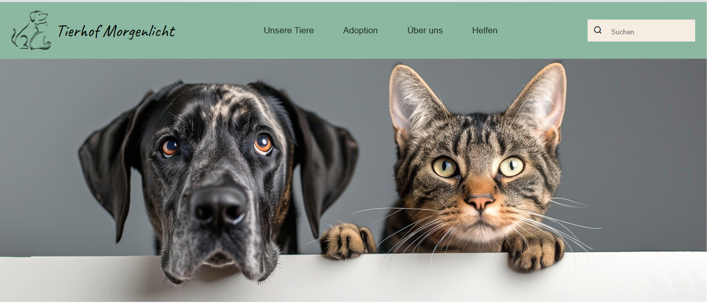

# Mega Dropdown

Eine kleine Vite-basierte HTML/CSS/JS Demo mit einem responsiven Mega-Dropdown-Menü.

## Vorschau



> **Live Demo:** (https://css-html-fundamentals-mega-dropdown.vercel.app/)

## Features

- Responsives Mega-Dropdown-Menü
- SCSS-Struktur mit Variablen und Komponenten
- Vite Development Server

## Installation

```bash
npm install
```

## Entwicklung

```bash
npm run dev
```


## Produktion

```bash
npm run build
```

### Vorschau der Produktion

```bash
npm run preview
```

## Struktur

- `index.html` — Einstiegspunkt
- `src/main.js` — JavaScript-Entry
- `src/assets/scss/` — SCSS-Quellen
- `src/assets/images/` — Bilder und Icons
