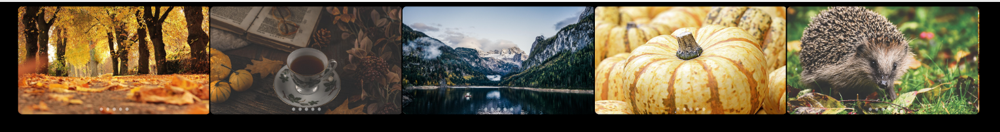

# Image Slider

Ein einfaches Image-Slider-Projekt mit Vite, SCSS und sauberer Ordnerstruktur.

## Vorschau

## Live Demo

- Live Demo: ()

## Installation

1. `npm install`
2. `npm run dev`

## Projektstruktur

- `index.html` - Einstiegspunkt
- `src/main.js` - JavaScript-Anwendung
- `src/assets/scss/` - SCSS-Stile
- `src/assets/images/` - Bilder für den Slider

## Nutzung

- Füge deine Bilder in `src/assets/images/` ein.
- Passe `src/assets/scss/` bei Bedarf an.
- Starte den Entwicklungsserver mit `npm run dev`.
