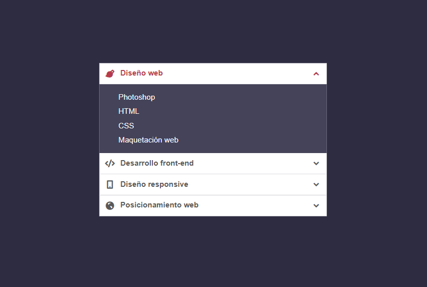

# Accordion Demo

Ein kleines Vanilla-JavaScript-Projekt mit Vite und SCSS, das eine Akkordeon-Komponente zeigt.

## Inhalt

- `index.html` - Einstiegspunkt der Anwendung
- `src/main.js` - JavaScript-Logik
- `src/assets/scss/` - SCSS-Styling
- `vite.config.js` - Vite-Konfiguration

## Installation

```bash
npm install
```

## Entwicklung starten

```bash
npm run dev
```

Öffne dann die angezeigte URL im Browser.

## Build

```bash
npm run build
```

## Vorschau

```bash
npm run preview
```

## Screenshot

