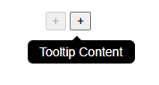

# Tooltip

Kurze Beschreibung
------------------
Dies ist ein kleines Tooltip-Beispielprojekt (lokales Demo-Frontend). Diese README enthält einen Platzhalter für einen Screenshot, den du durch ein echtes Bild ersetzen kannst.

Installation
------------
1. Abhängigkeiten installieren:

```
npm install
```

2. Entwicklungsserver starten (falls Vite oder ein ähnliches Skript vorhanden ist):

```
npm run dev
```

Verwendung
---------
Öffne die Seite im Browser.

Screenshot
------------------------


Projektstruktur (auszugsweise)
----------------------------
- index.html
- package.json
- src/
  - main.js
  - assets/
    - scss/