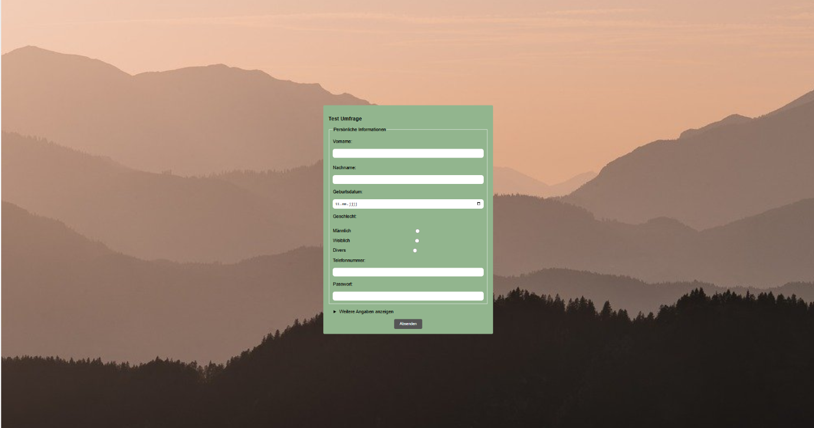

# Formular

Ein leichtgewichtiges Formular-UI-Template, aufgebaut mit Vite und modularen SCSS-Dateien. Es bietet responsive Layouts, wiederverwendbare Formular-Komponenten und eine klare SCSS-Ordnerstruktur (Tokens, Tools, Elements, Components, Utilities) — ideal als Starter für Formular-Interfaces in Projekten.

## Screenshot


## Live Demo

Live Demo: 


## Installation

- Node.js installieren (empfohlen: aktuelle LTS-Version)
- Abhängigkeiten installieren:

```bash
npm install
```

- Entwicklungsserver starten:

```bash
npm run dev
```

## Ordnerstruktur (Kurz)

- `src/` – Quellcode
- `src/assets/scss/` – SCSS-Dateien
- `src/assets/images/` – Bilder (Screenshot hier ablegen)