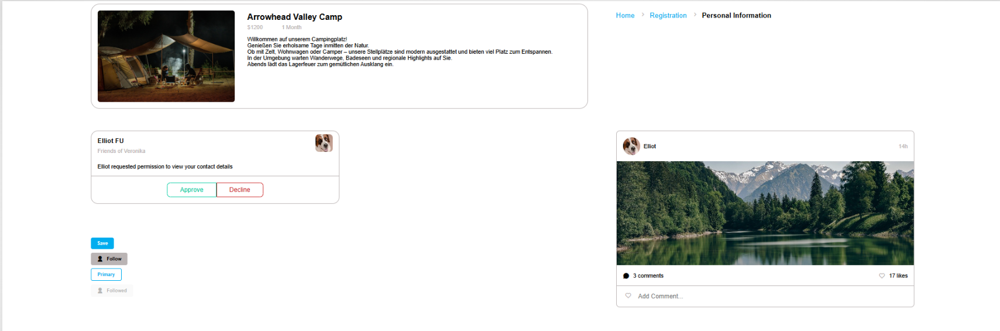

# UI Library

Eine kleine UI-Bibliothek basierend auf Vite und Sass.

## 🚀 Features

- Komponenten-Bibliothek mit Buttons, Cards, Breadcrumbs und Media Blocks
- Sass-Struktur mit Token-, Element-, Objekt- und Komponenten-Ebenen
- Schnelle lokale Entwicklung mit Vite

## 📸 Screenshot




## 🌐 Live Demo

Eine Live-Demo ist verfügbar unter:

(https://css-html-fundamentals-ui-library.vercel.app/)

## 🧪 Lokale Entwicklung

```bash
npm install
npm run dev
```

## 📦 Build

```bash
npm run build
```

## 🔍 Vorschau

```bash
npm run preview
```

## 📁 Projektstruktur

- `index.html` – Einstiegspunkt der Demo
- `src/main.js` – Hauptdatei für JavaScript
- `src/assets/scss/` – Sass-Dateien und Komponenten-Stile

## 📝 Hinweise

- Passe den Screenshot-Pfad und die Live-Demo-URL an deine Projektumgebung an.
- Ergänze bei Bedarf zusätzliche Komponentenbeschreibungen oder Anwendungsbeispiele.
