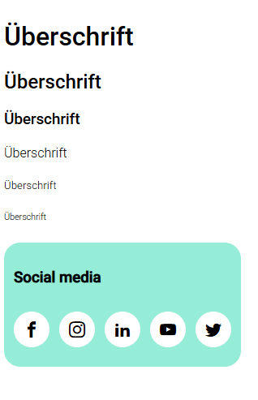

# Iconfont & Webfont

Eine moderne Web-Anwendung zur Verwaltung und Anzeige von Icon-Fonts und Web-Fonts mit SCSS-Styling und Vite als Build-Tool.

**Screenshot:**



## 🎯 Features

- **Icon-Font Integration** - Icomoon Icon-Font mit Social-Media-Icons
- **Web-Font Support** - Roboto Font Integration
- **SCSS Struktur** - Organisiert nach ITCSS-Prinzipien (Settings, Tools, Generic, Elements, Objects, Components)
- **Responsive Design** - Mobile-first Approach mit sass-mq Breakpoints
- **Vite Build System** - Schneller Development und Production Build

## 📋 Projektstruktur

```
iconfont-webfont/
├── src/
│   ├── main.js
│   └── assets/
│       ├── fonts/
│       │   ├── iconfont/        # Icon-Font (Icomoon)
│       │   └── roboto/          # Roboto Web-Font
│       ├── icons/
│       └── scss/
│           ├── 01-tokens/       # Design Token (Farben, Spacing, Typografie)
│           ├── 02-tools/        # SCSS Tools & Mixins
│           ├── 03-generic/      # Generische Stile (Font-Face, Reset)
│           ├── 04-elements/     # HTML Element Stile 
│           └── 06-components/   # UI Komponenten
├── public/                       # Static Assets
├── index.html
├── package.json
└── vite.config.js
```

## 🚀 Installation & Setup

### Voraussetzungen
- Node.js (v16+)
- npm oder yarn

### Installation

```bash
# Abhängigkeiten installieren
npm install

# Development Server starten
npm run dev

# Production Build erstellen
npm run build

# Preview des Production Build
npm run preview
```

## 🎨 Komponenten

### Social Media Bar
Zeigt Social-Media-Icons an:
- Facebook
- Instagram
- LinkedIn
- YouTube
- Twitter

### Typografie
Überschriften mit verschiedenen Größen (H1-H6):
- Standard Überschriften
- Light-Variante für H4-H6


## 🎯 ITCSS Struktur

Das Projekt folgt der **ITCSS** (Inverted Triangle CSS) Architektur:

1. **Tokens** - CSS Custom Properties und Design-Konstanten
   - Breakpoints
   - Farben
   - Spacing
   - Typografie

2. **Tools** - SCSS Mixins und Funktionen
   - Media Query Mixin (sass-mq)
   - Wrapper Utilities

3. **Generic** - Breite, weit reichende Stile
   - Font-Face Definitionen
   - Globale Resets

4. **Elements** - Unklassifizierte HTML-Elemente
   - Headline Styling
   - Page/Body Styling

6. **Components** - Spezifische UI-Komponenten
   - Icons
   - Social Media Bar
   - weitere Custom Components

## 🔧 Verwendete Technologien

- **Vite** - Moderner Build Tool
- **SCSS** - CSS Präprozessor
- **sass-mq** - Media Query Mixin Library
- **Icomoon** - Icon Font Generator
- **Roboto Font** - Google Webfont

## 📝 Verfügbare Scripts

```bash
npm run dev      # Startet Dev Server mit Hot-Reload
npm run build    # Erstellt optimierten Production Build
npm run preview  # Previewt den Production Build
```

## 📚 Asset-Pfade

### Fonts
- **Iconfont:** `/fonts/iconfont/fonts/`
- **Roboto:** `/fonts/roboto/`

Die Fonts werden über die SCSS-Variablen konfiguriert:
- `$icomoon-font-path` - Icomoon Font Pfad
- `$font-path` - Roboto Font Pfad

## 🎨 Farben & Tokens

Design-Farben und Abstände sind in den Token-Dateien definiert:
- [_colors.scss](src/assets/scss/01-tokens/_colors.scss)
- [_spacing.scss](src/assets/scss/01-tokens/_spacing.scss)
- [_typography.scss](src/assets/scss/01-tokens/_typography.scss)

## 📱 Breakpoints

Responsive Breakpoints (via sass-mq):
- **Mobile First Approach**